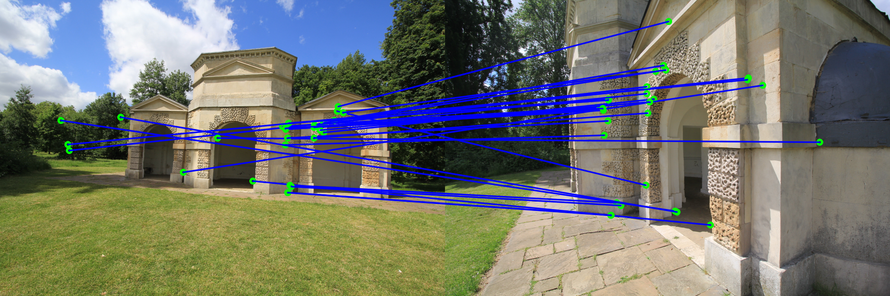

# Object Recognition via Image Features Detection & Matching in OpenCV-Python

  
  

## 1.  Objectives

The objective of this section is to demonstrate feature matching and object detection using OpenCV Python. 

## 2.  Object recognition via feature matching

* A computer vision object recognition process has the following steps:

  * Acquire the image of the scene
  * Detect key points and features
  * Try to match detected features with those extracted from known objects stored in the data base
  * Identify the new imaged object or scene based on any successful matches in step 3. 
  * That is the object is associated with the data base object yielding a sufficiently high number of matches, if there is one.

In this section, we shall implement and illustrate a selected set of image feature matching and object recognition algorithms that are available in OpenCV. In particular, we shall illustrate how to match features in one image with another using the following feature matching algorithms in OpenCV:

  * Brute-Force matcher
  * FLANN Matcher.

Next, we present the input query and scene images.

## 3.  Input Images

The query and scene images are illustrated in the figure below. Our objective is to detect and localize the query image in the scene image.

## 4.  Development

* Author: Mohsen Ghazel (mghazel)
* Date: March 31st, 2021
* Project: Image Features Matching & Object Recognition:
  * The objective of this project is to demonstrate how to match features and recognize objects in a scene using OpenCV with Python API
  * We shall implement various types of features matching algorithms.
  
### 4.1. Step 1: Python Imports:

<pre style="color:#000000;background:#e6ffff;font-size:10px;line-height:1.5;"># system environment
import sys
# I/O
import os
# OpenCV
import cv2
# Numpy
import numpy as np
# matplotlib
import matplotlib.pyplot as plt
# image processing library
import matplotlib.image as mpimg
# date and time
import datetime

# import warnings
import warnings
# suppress warnings
warnings.filterwarnings("ignore")

# check for successful package imports and versions
# python
print("Python version : {0} ".format(sys.version))
# OpenCV
print("OpenCV version : {0} ".format(cv2.__version__))
# numpy
print("Numpy version  : {0}".format(np.__version__))

Python version : 3.7.10 (default, Feb 20 2021, 21:17:23) 
[GCC 7.5.0] 
OpenCV version : 4.1.2 
Numpy version  : 1.19.5 

print(__doc__)
Automatically created module for IPython interactive environment 

</pre>

### 4.2. Step 2: Read and visualize the input images:

<pre style="color:#000000;background:#e6ffff;font-size:10px;line-height:1.5;">#-----------------------------------------------------------------------
# 2.1) Read the query-image
#-----------------------------------------------------------------------
# The input query image file name
query_img_file_path_name = os.path.join("sample_data","box.png")
# read the input query-image
img_query = cv2.imread(query_img_file_path_name)

# check if the query-image is read successfully
if img_query is None:
    sys.exit("Could not read the image file: " + query_img_file_path_name)

# check if it is grayscale image, if so convert it to RGB by 
# duplicating the channel
if (len(img_query.shape) == 2):
  mg_query = np.uint8(cv2.merge([mg_query,mg_query,mg_query]))

# check if it is color image, if so convert it to grayscale
if (len(img_query.shape) &gt; 2):
    gray_query = cv2.cvtColor(img_query, cv2.COLOR_BGR2GRAY)
else: # make a copy of the query-image
    gray_query = img_query.copy()

#-----------------------------------------------------------------------
# 2.2) Read the scene image
#-----------------------------------------------------------------------
# The input scene image file name
scene_img_file_path_name = os.path.join("sample_data","box-in-scene.png")
# read the input scene-image
img_scene = cv2.imread(scene_img_file_path_name)

# check if the scene-image is read successfully
if img_scene is None:
    sys.exit("Could not read the image file: " + scene_img_file_path_name)

# check if it is grayscale image, if so convert it to RGB by 
# duplicating the channel
if (len(img_scene.shape) == 2):
  mg_scene = np.uint8(cv2.merge([mg_scene,mg_scene,mg_scene]))

# check if it is color image, if so convert it to grayscale
if (len(img_scene.shape) &gt; 2):
    gray_scene = cv2.cvtColor(img_scene, cv2.COLOR_BGR2GRAY)
else: # make a copy of the scene-image
    gray_scene = img_scene.copy()

#-----------------------------------------------------------------------
# 2.3) Display the scene and the query images:
#-----------------------------------------------------------------------
# create a figure
plt.figure("Input scene and query images",figsize=(12,10))
#-----------------------------------------------------------------------
# 2.3.1) display the input query-image 
#-----------------------------------------------------------------------
# display the original query-image
plt.subplot(122)
plt.title("Query-image", fontsize = 12)
plt.xticks([]), plt.yticks([])
plt.subplot(122)
# display the query-image
# - if the image is RGB
if (len(img_query.shape) &gt; 2):
    plt.imshow(img_query);
else: # for grayscale image
    plt.imshow(img_query, cmap='gray');
#-----------------------------------------------------------------------
# 2.3.2) display the input scene-image 
#-----------------------------------------------------------------------
# create a figure
plt.figure("Input scene and query images",figsize=(12,10))
# display the original scene-image
plt.subplot(121)
plt.title("Scene-image", fontsize = 12)
plt.xticks([]), plt.yticks([])
# display the scene image
# - if the image is RGB
if (len(img_scene.shape) &gt; 2):
    plt.imshow(img_scene);
else: # for grayscale image
    plt.imshow(img_scene, cmap='gray');
</pre>

### 4.3. Step 3: Brute-Force Feature Matching:

* Brute-Force matcher is simple:
  * It takes the descriptor of each query-image feature in first and matches it with all other features in scene-image using some distance calculation and the closest one is returned.
  * This process is repeated for all the features
  * In the end we pick the K features, based on the distances separating the query feature and its matched reference-image feature.

<pre style="color:#000000;background:#e6ffff;font-size:10px;line-height:1.5;">#=================================================================
# 3) Brute-Force Feature Matcher
#=================================================================
# Step 1: Detect the features from the scene and query 
#         images:
#-----------------------------------------------------------------
#         - We compute the ORB features
#         - One may experiment with computing other features
#           such as Harris corners, FAST, BRIEF, etc.
#-----------------------------------------------------------------
# Initiate ORB detector
orb = cv2.ORB_create()

# find the keypoints and descriptors with ORB
# - for the query image
kp_query, des_query = orb.detectAndCompute(gray_query,None)
# - for the scene image
kp_scene, des_scene = orb.detectAndCompute(gray_scene,None)

#-----------------------------------------------------------------
# Step 2: Match the scene and query images features using the 
#         Brute-Force Matcher.
#-----------------------------------------------------------------
# create BFMatcher object
bf = cv2.BFMatcher(cv2.NORM_HAMMING, crossCheck=True)

# Match descriptors.
matches = bf.match(des_query,des_scene)

# Sort them in the order of their distance.
matches = sorted(matches, key = lambda x:x.distance)

#-----------------------------------------------------------------
# Step 3: Visualize the matches
#-----------------------------------------------------------------
# visualization preferences parameters
draw_params = dict(matchColor = (0,255,255),  # matching-lines color
                   singlePointColor = (0,255,0), #  keypoints color
                   flags = cv2.DrawMatchesFlags_DEFAULT) # show kepoints and matching lines
# Draw first 15 matches.
img3 = cv2.drawMatches(img_query,kp_query,img_scene,kp_scene,matches[:15],None,**draw_params)
# create the figure
plt.figure("BFMatcher - Best Match",figsize=(12,16))
plt.subplot(111)
plt.title("Brute-Force Matcher: The 15 matches", fontsize = 12)
plt.xticks([]), plt.yticks([])
plt.imshow(img3);
</pre>

### 4.4. Step 4: FLANN Based Feature Matching:

* FLANN stands for Fast Library for Approximate Nearest Neighbors:
  * It contains a collection of algorithms optimized for fast nearest neighbor search in large datasets and for high dimensional features
  * It works faster than BFMatcher for large datasets.
  
 
<pre style="color:#000000;background:#e6ffff;font-size:10px;line-height:1.5;">#-----------------------------------------------------------------
# 4) FLANN-Based Feature Matcher
#-----------------------------------------------------------------
# 4.1) Detect the features from the scene and query 
#      images:
#-----------------------------------------------------------------
#         - We compute the ORB features
#         - One may experiment with computing other features
#           such as Harris corners, FAST, BRIEF, etc.
#-----------------------------------------------------------------
# Initiate ORB detector
orb = cv2.ORB_create()
# find the keypoints and descriptors with ORB
# - for the query image
kp_query, des_query = orb.detectAndCompute(gray_query,None)
# - for the scene image
kp_scene, des_scene = orb.detectAndCompute(gray_scene,None)

#-----------------------------------------------------------------
# 4.2) Apply FLANN matcher
#-----------------------------------------------------------------
# When using ORB features, you can pass the following. 
FLANN_INDEX_LSH = 6
index_params= dict(algorithm = FLANN_INDEX_LSH,
               table_number = 6, # 12
               key_size = 12,     # 20
               multi_probe_level = 1) #2
# search params
search_params = dict(checks=50)   # or pass empty dictionary
# create the FLANN matcher
flann = cv2.FlannBasedMatcher(index_params, search_params)
#  We apply the knnMatch() to get k best matches. 
# - In this example, we will take k=2 so that we can apply ratio test
matches = flann.knnMatch(des_query, des_scene, k=2)

# Need to draw only good matches, so create a mask
matchesMask = [[0,0] for i in range(len(matches))]

# ratio test as per Lowe's paper
for i,(m,n) in enumerate(matches):
    if m.distance &lt; 0.75*n.distance:
        matchesMask[i]=[1,0]

#-----------------------------------------------------------------
# 4.3) Visualize the matches
#-----------------------------------------------------------------  
# visualization preferences parameters       
draw_params = dict(matchColor = (0,255,255),  # matching-lines color
                   singlePointColor = (0,255,0), #  keypoints color
                   matchesMask = matchesMask,
                   flags = cv2.DrawMatchesFlags_DEFAULT) # show kepoints and matching lines
# overlay the matches on the images
img3 = cv2.drawMatchesKnn(img_query,kp_query,img_scene,kp_scene,matches,None,**draw_params)

# create the figure
plt.figure("FLANN-Based Feature Matching",figsize=(12,16))
plt.subplot(111)
plt.title("FLANN-Based Feature Matching", fontsize = 12)
plt.xticks([]), plt.yticks([])
plt.imshow(img3);
</pre>

### 4.5. Step 5: Query Image Recognition:

* The matched features are used to estimate the Homography matrix:

  * The Homography matrix H is a 3x3 matrix, which provides a linear transformation between query and scene images
  * It transforms the query-image plane P1 to the scene-image plane P2.
  * Once the Homography matrix H is estimated:
  * We can then localize the query image in the scene image by mapping its four corners/vertices using the Homography matrix H.

<pre style="color:#000000;background:#e6ffff;font-size:10px;line-height:1.5;">#-----------------------------------------------------------------  
# Step 5: Query Image Recognition: FLANN-Based Feature Matching
#-----------------------------------------------------------------  
# 5.1) Store all the good matches satisfying the ratio test.
#-----------------------------------------------------------------  
good = []
# filter all the matches:
#  - only keep the good matches based on Ratio Test
for m,n in matches:
    if m.distance &lt; 0.75*n.distance:
        good.append(m)
#-----------------------------------------------------------------
# 5.2) Compute the Homography matrix and map the query image to 
#      the scene image
#-----------------------------------------------------------------
# - This can only be done if we have a sufficient number of matches:
# - The minimum number of good matches required 
#-----------------------------------------------------------------
MIN_MATCH_COUNT = 10
# if we have sufficient number of good matches
if len(good)&gt;MIN_MATCH_COUNT:
    # the query image matches
    src_pts = np.float32([ kp_query[m.queryIdx].pt for m in good ]).reshape(-1,1,2)
    # the scene image matches
    dst_pts = np.float32([ kp_scene[m.trainIdx].pt for m in good ]).reshape(-1,1,2)
    # compute the homography by solving a system of equations
    M, mask = cv2.findHomography(src_pts, dst_pts, cv2.RANSAC,5.0)
  # display the homography matrix
    print("The estimated Homography matrix: H = " + str(M))
    # process the mask to convert it list
    matchesMask = mask.ravel().tolist()
    # the shape of the query image
    h,w,d = img_query.shape
    # get the four corner so fthe query images
    pts = np.float32([ [0,0],[0,h-1],[w-1,h-1],[w-1,0] ]).reshape(-1,1,2)
    # map the four corners o fthe queery image using the estimated homography
    dst = cv2.perspectiveTransform(pts,M)
    # overlay the boundaries of the detected query image on the scene image
    img_scene = cv2.polylines(img_scene,[np.int32(dst)],True,255,3, cv2.LINE_AA)
else: # in case there is not enough good matches
    print("Not enough matches are found - {0}/{1}".format(len(good),MIN_MATCH_COUNT))
    matchesMask = None
    
#-----------------------------------------------------------------
# 5.3) Visualize the matches
#-----------------------------------------------------------------
# visualization preferences parameters
draw_params = dict(matchColor = (0,255,255),  # matching-lines color
                   singlePointColor = (0,255,0), #  keypoints color
                   matchesMask = matchesMask, # draw only inliers
                   flags = cv2.DrawMatchesFlags_DEFAULT) # show kepoints and matching lines

#-----------------------------------------------------------------
# 5.4) Overlay the final results on the query and scene images:
#-----------------------------------------------------------------
# - detected features for the query and scene images
# - The mactched features between the 2 images
# - The detected location of the query image in the scene image
#-----------------------------------------------------------------
img3 = cv2.drawMatches(img_query,kp_query,img_scene,kp_scene,good,None,**draw_params)
plt.figure("Final Query Image Recognition",figsize=(16,12))
plt.subplot(111)
plt.title("Final Query Image Recognition")
plt.xticks([]), plt.yticks([])
plt.imshow(img3);

The estimated Homography matrix: 

H = 	[[ 4.43847781e-01 -1.17603871e-01  1.17431301e+02]
 	[-4.31125831e-03  4.81667451e-01  1.59213335e+02]
 	[-3.03207257e-04 -6.99782680e-05  1.00000000e+00]] 
</pre>

### 4.6. Step 6: End of Execution:

* Display a successful end of execution message

<pre style="color:#000000;background:#e6ffff;font-size:10px;line-height:1.5;">## display a final message
# current time
now = datetime.datetime.now()
# display a message
print('Program executed successfully on: '+ str(now.strftime("%Y-%m-%d %H:%M:%S") + "...Goodbye!\n"))

Program executed successfully on: 2021-04-01 00:51:48...Goodbye! 
</pre>

## 5. Analysis

* In view of the illustrated results, we make the following observations:

  % The two feature matching methods yield sufficient number of correctly matches features between the query and scene images
  * The query image is perfectly localized in the scene image.

## 5. Future Work

* We propose to explore the following tasks:

  * To explore different types of feature detection and matching combinations for object detection and localization
  * To explore the effects of the following factors on objection recognition performance:
    * Occlusion
    * Illumination
    * Orientation
    * Scale
    * Presence of similar objects (ex. bottle of Regular Coke vs Diet Coke)

## 6. Reference

1. OpenCV. Feature Matching. https://docs.opencv.org/master/dc/dc3/tutorial_py_matcher.html
2. OpenCV. Feature Matching. https://opencv-python-tutroals.readthedocs.io/en/latest/py_tutorials/py_feature2d/py_matcher/py_matcher.html#
3. Kaggle. Object recognition using feature matching. https://www.kaggle.com/dataenergy/object-recognition-using-feature-matching
4. OpenCV. Feature Matching + Homography to find Objects. https://opencv-python-tutroals.readthedocs.io/en/latest/py_tutorials/py_feature2d/py_feature_homography/py_feature_homography.html 
5. Strahinja Zivkovic. Feature Matching methods comparison in OpenCV. http://datahacker.rs/feature-matching-methods-comparison-in-opencv/ 
6. Feature Matching (Homography) Brute Force OpenCV Python Tutorial. https://pythonprogramming.net/feature-matching-homography-python-opencv-tutorial/ 
7. OpenCV. Feature Matching with FLANN. https://www.ccoderun.ca/programming/doxygen/opencv/tutorial_feature_flann_matcher.html 
8. Aishwarya Singh  A Detailed Guide to the Powerful SIFT Technique for Image Matching (with Python code). https://www.analyticsvidhya.com/blog/2019/10/detailed-guide-powerful-sift-technique-image-matching-python/

